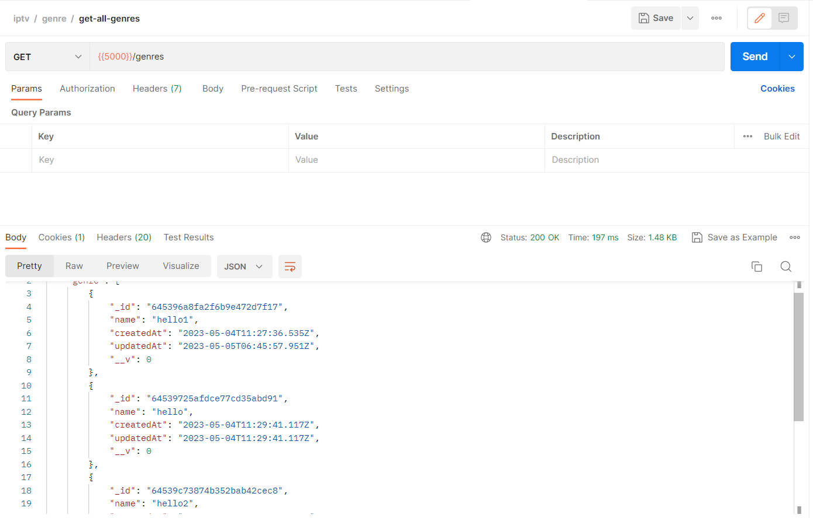

# IPTV

This IPTV project is a comprehensive solution for anyone looking to watch their favorite series online, with all the necessary features and functionality built into a single platform.

## Installation

Open your terminal and clone this project

```bash
git clone https://github.com/Huzaifa-Saleem/IPTV-express-typescript.git iptv
```

## Start

To start this project, first install all the dependencies

```bash
npm install
```

If you have nodemon globally install then you are good to go and if not you can install it in your project by,

```bash
npm install --save-dev nodemon
```

now you are all setup to start the server by:

```bash
npm run dev
```

## Api-Documentation

To open the Swagger documentation you can go to the once you start the server:

[Swagger](http:localhost:5000/api-docs)

and you can get the postman collection from this link:

[Postman](https://cloudy-desert-161727.postman.co/workspace/My-Workspace~51859a10-349f-4603-8e27-160fa551e9db/collection/19733281-fb730660-edde-4239-91f4-3c8253e7f8e8?action=share&creator=19733281)

### Few Examples of postman collection are shown below:





## Contributing

Pull requests are welcome. For major changes, please open an issue first
to discuss what you would like to change.
